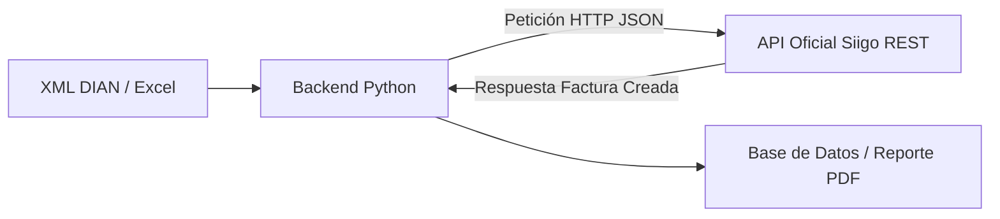

# 🚀 Análisis Técnico de Arquitectura Futura: Automatizador de Facturas & Siigo POS

---

## 1. 📊 Estado Actual del Sistema

El sistema actual opera como una **aplicación monolítica local**:
- **Interfaz de Usuario**: Streamlit (`gui_app.py`).
- **Motor de Datos**: SQLite local (`automatizador.db` / `ventas.db`).
- **Procesamiento de Documentos**: Extracción de archivos ZIP, parseo de XMLs de DIAN, normalización de productos y exportación en PDF/Excel.
- **Automatización Siigo POS**: Selenium WebDriver manipulando navegadores locales (Microsoft Edge en Windows, Firefox en Linux) utilizando perfiles persistentes para conservar la sesión iniciada en Siigo.

---

## 2. 💡 Evaluación de Opciones de Implementación Futura

A continuación se analizan 4 alternativas para evolucionar este proyecto según las necesidades de rendimiento, accesibilidad y facilidad de uso.

---

### 🎨 Opción 1: Aplicación de Escritorio Nativa (PyInstaller + Window Wrapper)
**¿En qué consiste?**
Empaquetar la aplicación de Python y Streamlit en un único archivo ejecutable `.exe` independiente que no requiera tener Python ni dependencias instaladas en la máquina cliente.

- **Ventajas**:
  - ⭐ **Cero instalación de Python**: El usuario final solo hace doble clic en un ejecutable `.exe`.
  - 🖥️ Interfaz tipo escritorio nativa usando herramientas como `pywebview` o `Electron` embebiendo Streamlit.
- **Desventajas**:
  - El peso del instalador `.exe` suele ser elevado (> 200 MB por incluir el runtime de Python y Selenium).
  - Sigue dependiendo de los navegadores locales del computador cliente para la automatización de Siigo.

---

### 🌐 Opción 2: Despliegue Web en la Nube (VPS + Docker + Headless Selenium)
**¿En qué consiste?**
Subir la aplicación a un servidor privado en la nube (VPS en Hetzner, DigitalOcean o AWS) dentro de contenedores **Docker**.

- **Ventajas**:
  - 🌍 **Acceso universal**: Se puede usar desde cualquier computador, tablet o celular mediante un enlace web HTTPS.
  - 🔄 **Procesamiento continuo**: Puede procesar facturas en segundo plano sin consumir recursos de la computadora local.
  - 🛡️ **Respaldos centralizados**: Base de datos PostgreSQL/SQLite y archivos guardados de forma segura en la nube.
- **Desventajas**:
  - La automatización de Siigo con Selenium en modo *Headless* (sin pantalla) en la nube puede requerir resolver CAPTCHAs o manejar renovaciones de sesión periódicas de forma remota.

---

### ⚡ Opción 3: Migración a la API Oficial de Siigo REST (RECOMENDADA A MEDIANO PLAZO)
**¿En qué consiste?**
Sustituir el módulo de automatización con navegadores (Selenium) por llamadas directas a la **API REST oficial de Siigo** (`api.siigo.com`).

- **Ventajas**:
  - ⚡ **Velocidad extrema**: Procesamiento de 50 facturas en segundos (en lugar de minutos por Selenium).
  - 🔒 **100% Robusto e Inmune a Cambios Visuales**: No falla si Siigo cambia el diseño de sus botones o menús en la web.
  - 🤖 **Totalmente Silencioso**: No requiere abrir navegadores, Edge, Firefox ni interacción manual de login.
- **Desventajas**:
  - Requiere contar con credenciales de API (`Username` y `Access Key`) proporcionadas por Siigo en planes empresariales/desarrollador.

---

### 🧩 Opción 4: Arquitectura Decoplada de Microservicios (FastAPI + Frontend Web)
**¿En qué consiste?**
Separar el sistema en dos capas distintas:
1. **Backend API (FastAPI/Python)**: Encargado del cálculo de precios, procesamiento XML DIAN, lógica contable y comunicación con Siigo.
2. **Frontend moderno (React / Next.js / Vue o Streamlit)**: Interfaz gráfica limpia y ultrarrápida.

- **Ventajas**:
  - Escala fácilmente si en el futuro se quiere integrar con otros sistemas de inventario o facturación.
  - Permite crear aplicaciones móviles o portales para clientes.
- **Desventajas**:
  - Mayor complejidad de desarrollo inicial.

---

## 🛠️ 3. Hoja de Ruta Sugerida (Roadmap)

| Fase | Alcance | Estado / Objetivo |
| :--- | :--- | :--- |
| **Fase 1 (Actual)** | **Lanzador Local (`.bat` + Acceso Directo)** | **COMPLETADO** ✅. Ejecución con un solo clic desde el Escritorio de Windows. |
| **Fase 2 (Corto Plazo)** | **Contenedor Docker Local** | Crear `Dockerfile` + `docker-compose.yml` para ejecutar la app en cualquier sistema (Windows/Linux/Mac) con un solo comando `docker compose up`. |
| **Fase 3 (Mediano Plazo)** | **Integración API REST Siigo** | Consultar acceso a API Key de Siigo para reemplazar el robot Selenium por llamadas HTTP directas. |
| **Fase 4 (Largo Plazo)** | **Despliegue Cloud (VPS)** | Desplegar la aplicación en un servidor Web VPS con seguridad HTTPS y autenticación de usuarios. |

---
